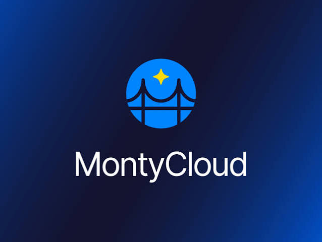

<p align="center">
  
</p>

# CCB — CloudOps Competency Benchmark

[](https://www.python.org/downloads/)

A benchmark for evaluating AI agents on real-world cloud operations (CloudOps) tasks.

## Overview

CCB measures how well a CloudOps agent investigates a live AWS account — does it find the
misconfigured resources, avoid flagging the healthy ones, and back its findings with evidence
it actually retrieved rather than plausible guesses.

Instead of scoring against static fixtures, CCB runs each agent against a **real AWS
environment** you deploy from CloudFormation with known, intentional misconfigurations
(public S3 buckets, keys without rotation, security groups open to the internet, and so on).
An agent investigates the environment with read-only tools; CCB scores what it found against
a per-scenario answer key.

The public benchmark ships **40 scenarios** across eight CloudOps categories on AWS, at the two
lowest of CCB's five autonomy levels: **L1** (find the misconfigured resources) and **L2**
(produce a remediation plan).

### Autonomy levels (L1–L5)

CCB grades every scenario on a five-level model of AI autonomy (adapted from SAE J3016 /
aviation safety standards), each with a **Human Intervention Budget (HIB)** — the max human
touchpoints allowed per run:

| Level | Name | What the agent does | HIB | Status |
|-------|------|---------------------|:---:|--------|
| **L1** | Assistive | Retrieves & presents information; human drives the workflow | ∞ | ✅ Implemented |
| **L2** | Analytical | Independent analysis → structured assessment (no recommendations) | 4 | ✅ Implemented |
| **L3** | Advisory | Contextual recommendations with tradeoff analysis; human approves | 3 | 🔜 Future |
| **L4** | Semi-Autonomous | Bounded execution inside a sandbox (dry-run, rollback, blast-radius limits) | 1 | 🔜 Future |
| **L5** | Autonomous | Closed-loop observe→analyze→plan→execute→verify (MAPE-K) | 0 | 🔜 Future |

**Only L1 and L2 are implemented today.** They are read-only, so they can be scored against a
deployed environment without changing it. **L3–L5 are defined by the framework but not yet
built** — L4/L5 require sandboxed execution and post-action state verification, which is the
next milestone. Full definitions: [docs/AUTONOMY_LEVELS.md](docs/AUTONOMY_LEVELS.md).

## How It Works

Using CCB follows three steps:

1. **Provision** the AWS environment — deploy the fixtures, then snapshot the deployed
   resources into a manifest.
2. **Run** the benchmark — the agent investigates each scenario; CCB scores the result.
3. **Tear down** the environment — remove the deployed resources.

CCB is built around a few core concepts:

| Concept       | Description                                                                                          |
| ------------- | --------------------------------------------------------------------------------------------------- |
| **Scenario**  | One CloudOps task (e.g. *"find every S3 bucket with public access"*) against the deployed AWS state. |
| **Fixtures**  | The CloudFormation stacks that build the real AWS resources a scenario is evaluated against.         |
| **Gold labels** | The per-scenario answer key: the resources that must be flagged, and the ones that must not be.    |
| **Agent**     | The system under evaluation. CCB drives it through a fixed set of read-only AWS tools.               |

Each run is scored on four pillars:

| Pillar       | Question                                                              |
| ------------ | -------------------------------------------------------------------- |
| **Answer**   | Did it identify the correct misconfigured resources?                 |
| **Fidelity** | Was its reasoning grounded in tool output, or fabricated? (LLM judge) |
| **Safety**   | Did it avoid recommending action on correctly configured resources?  |
| **Output**   | Did it return a well-formed answer in the required format?           |

## Scenarios

The 40 scenarios span eight CloudOps categories, mapped to the AWS Well-Architected pillars:

`S3 & data protection` · `IAM & access` · `KMS & encryption` · `networking (VPC/SG/NACL)` ·
`Lambda & serverless` · `observability (CloudWatch/logs)` · `DynamoDB & storage` ·
`API Gateway`

List them any time with `python -m runner.run --list`.

## Requirements

| Requirement           | Details                                                                      |
| --------------------- | --------------------------------------------------------------------------- |
| **OS**                | macOS or Linux                                                              |
| **Python**            | 3.12+                                                                        |
| **AWS**               | An account you can deploy test resources into, with the AWS CLI configured  |
| **Container runtime** | Docker — only for the offline local test (LocalStack)                      |
| **Node.js**           | 18+ — only for the results dashboard                                         |

## Installation

```bash
git clone <repo-url> && cd ACE-BENCH
python3 -m venv venv && source venv/bin/activate
pip install -r requirements.txt
cp .env.example .env      # add your AWS credentials
```

## Quickstart

```bash
# 1. Deploy the AWS fixtures (choose option 3: combined, single region)
cd benchmark/fixtures && ./deploy.sh && cd ../..

# 2. Snapshot the deployed resources into a manifest
python -m runner.provisioner --region us-east-1

# 3. List scenarios, then run one
python -m runner.run --list
python -m runner.run COPS-kms-keys-with-rotation-disable-L1-f8c2675f --agent toolloop --region us-east-1

# 4. Tear down when done (choose option 4: cleanup)
cd benchmark/fixtures && ./deploy.sh
```

Results are written to `runner/result/<agent>/` as JSON, one file per run.

## Usage

```bash
python -m runner.run --list                          # list all scenarios
python -m runner.run <scenario_id> --agent <agent>   # run one scenario
python -m runner.run --all --agent <agent>           # run the whole suite
python -m runner.provisioner --region <region>       # (re)build the manifest
```

Common flags for `runner.run`:

| Flag              | Purpose                                             |
| ----------------- | --------------------------------------------------- |
| `--agent`         | Agent to evaluate (default `toolloop`)              |
| `--region`        | AWS region the fixtures were deployed to            |
| `--all`           | Run every scenario that has gold labels             |
| `--level {1,2}`   | Restrict `--all` to L1 or L2                        |
| `--skip-existing` | Skip scenarios already run for this agent           |

## Evaluating your own agent

To evaluate any agent, provide two things: **AWS credentials** and an **agent endpoint**,
then use the `toolloop` agent. CCB offers your agent the read-only AWS tool catalog, runs it
through a tool-use loop against the deployed environment, and scores what it finds.

```
# .env
AWS_ACCESS_KEY_ID=...
AWS_SECRET_ACCESS_KEY=...
AWS_REGION=us-east-1
AGENT_ENDPOINT=https://your-agent.example.com/invoke
AGENT_AUTH_TOKEN=...        # optional
```

```bash
python -m runner.run --all --agent toolloop --region us-east-1
```

The tool loop covers 34 of the 40 scenarios; six cost scenarios need real account usage
history and are excluded from this path.

## Offline test (no AWS account)

You can verify the whole pipeline locally with no AWS account and no external agent — CCB
deploys the fixtures to **LocalStack** (fake AWS in Docker) and uses a local **Ollama** model
as the agent:

```bash
bash local_test/run_mock_localstack.sh
```

See [local_test/README.md](local_test/README.md) for details.

## Configuring AWS access

CCB deploys real resources and runs read-only queries against them, so it needs AWS
credentials for the account you are testing in. Set them in `.env` (or via a named profile),
and set `AWS_REGION` to the region you deployed the fixtures to. Every tool CCB runs against
your account is read-only; it never modifies resources.

## Troubleshooting

| Problem                                            | Solution                                                                 |
| -------------------------------------------------- | ------------------------------------------------------------------------ |
| `No environment manifest at …`                     | Run `python -m runner.provisioner --region <region>` after deploying     |
| `ExpiredToken` / credential errors                 | Refresh your AWS credentials (e.g. `aws sso login`)                       |
| A scenario reports `unresolved` resource handles   | Its fixture isn't deployed in that region — re-run `deploy.sh`           |
| `No agent endpoint`                                | Set `AGENT_ENDPOINT` in `.env` when using `--agent toolloop`             |

## Contributing

See [CONTRIBUTING.md](CONTRIBUTING.md) for how to add or fix a scenario.

## Contributors

- [@Arihant25](https://github.com/Arihant25)
- [@avi1o1](https://github.com/avi1o1)
- [@basilmontycloud](https://github.com/basilmontycloud)
- [@karthikv1392](https://github.com/karthikv1392)
- [@monty-bassam](https://github.com/monty-bassam)
- [@pranav-reds](https://github.com/pranav-reds)
- [@pratikgit-montycloud](https://github.com/pratikgit-montycloud)
- [@Venkat-MCU](https://github.com/Venkat-MCU)

## License

License to be finalized before public release.
